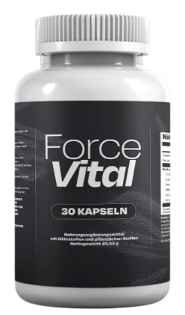
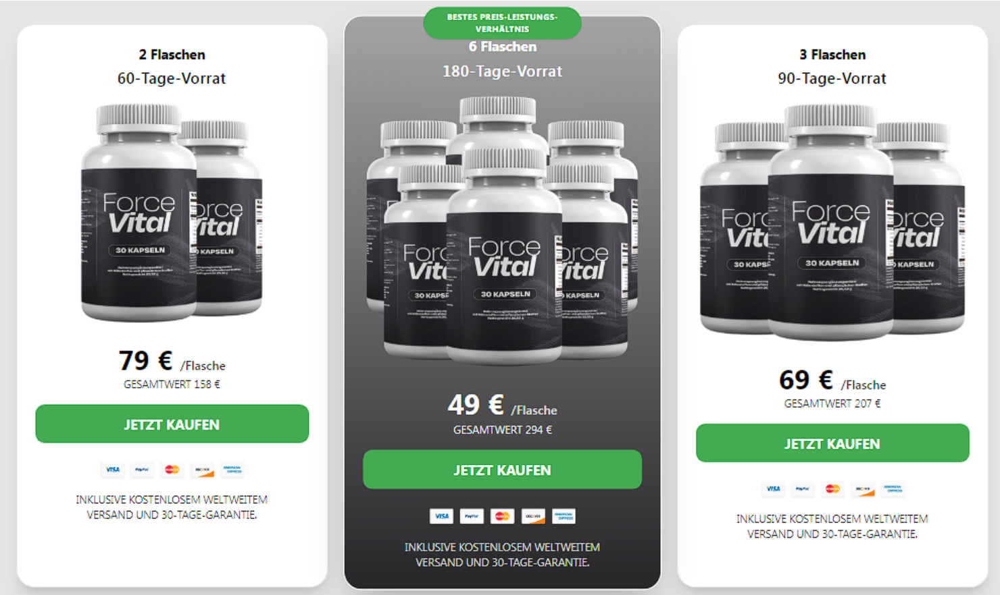

# ForceVital – Ratgeber für männliche Vitalität

**ForceVital** ist ein Informations- und Produktangebot für erwachsene Männer, die sich mit Themen wie Energie, Ausdauer, Libido, Selbstvertrauen und allgemeiner Vitalität beschäftigen. Weitere Details, aktuelle Produktinformationen und die offizielle Darstellung finden Sie direkt auf der Website: **[https://www.forcevital.cc/](https://www.forcevital.cc/)**.

## Worum geht es bei ForceVital?

ForceVital wird als natürliche Unterstützung für Männer vorgestellt, die ihr körperliches Wohlbefinden und ihr aktives Lebensgefühl bewusster stärken möchten. Der Schwerpunkt liegt auf einem ganzheitlichen Ansatz: Nicht nur einzelne Leistungsaspekte stehen im Mittelpunkt, sondern auch Alltagenergie, Motivation, Regeneration, Partnerschaft und ein gesunder Lebensstil.

Die offizielle ForceVital-Seite erklärt das Konzept ausführlicher: [ForceVital besuchen](https://www.forcevital.cc/).

## Mögliche Interessensbereiche

ForceVital kann für Männer interessant sein, die sich mit folgenden Zielen beschäftigen:

- mehr Energie und Präsenz im Alltag,
- ein stärkeres Gefühl von Vitalität und Selbstvertrauen,
- bewusste Unterstützung von Libido und Ausdauer,
- ein natürlich ausgerichtetes Supplement-Konzept,
- eine Ergänzung zu gesünderen Routinen wie Schlaf, Bewegung und ausgewogener Ernährung.

Aktuelle Informationen zum Angebot finden Sie auf der offiziellen Website: [www.forcevital.cc](https://www.forcevital.cc/).

## Inhaltsstoffe und Ansatz

Die Produktkommunikation von ForceVital hebt natürliche Inhaltsstoffe und pflanzliche Komponenten hervor. Solche Bestandteile werden im Wellness- und Supplement-Bereich häufig mit männlicher Vitalität, Energie, Durchblutung und allgemeinem Wohlbefinden in Verbindung gebracht.

Da Rezepturen, Hinweise und Verfügbarkeit sich ändern können, sollten Produktdetails immer direkt auf der offiziellen ForceVital-Seite geprüft werden: [https://www.forcevital.cc/](https://www.forcevital.cc/).

## Vitalität beginnt mit dem Lebensstil

Ein Produkt allein ersetzt keine gesunden Gewohnheiten. Wer sich langfristig vitaler fühlen möchte, sollte zusätzlich auf grundlegende Faktoren achten:

- regelmäßige Bewegung,
- ausreichend Schlaf,
- proteinreiche und nährstoffreiche Ernährung,
- Stressmanagement,
- offene Kommunikation in der Partnerschaft,
- realistische Erwartungen an Nahrungsergänzungen.

ForceVital kann als ergänzender Baustein betrachtet werden. Die Grundlage bleibt ein bewusster Lebensstil.

## Wichtiger Hinweis

ForceVital ist kein Ersatz für medizinische Beratung, Diagnose oder Behandlung. Personen mit bestehenden Erkrankungen, Medikamenteneinnahme, Allergien oder anhaltenden Beschwerden sollten vor der Nutzung von Nahrungsergänzungsmitteln ärztlichen Rat einholen.

## Offizielle Website

Mehr Informationen zu ForceVital, dem Produktkonzept und aktuellen Angaben finden Sie hier:

➡️ **[ForceVital offizielle Website](https://www.forcevital.cc/)**
